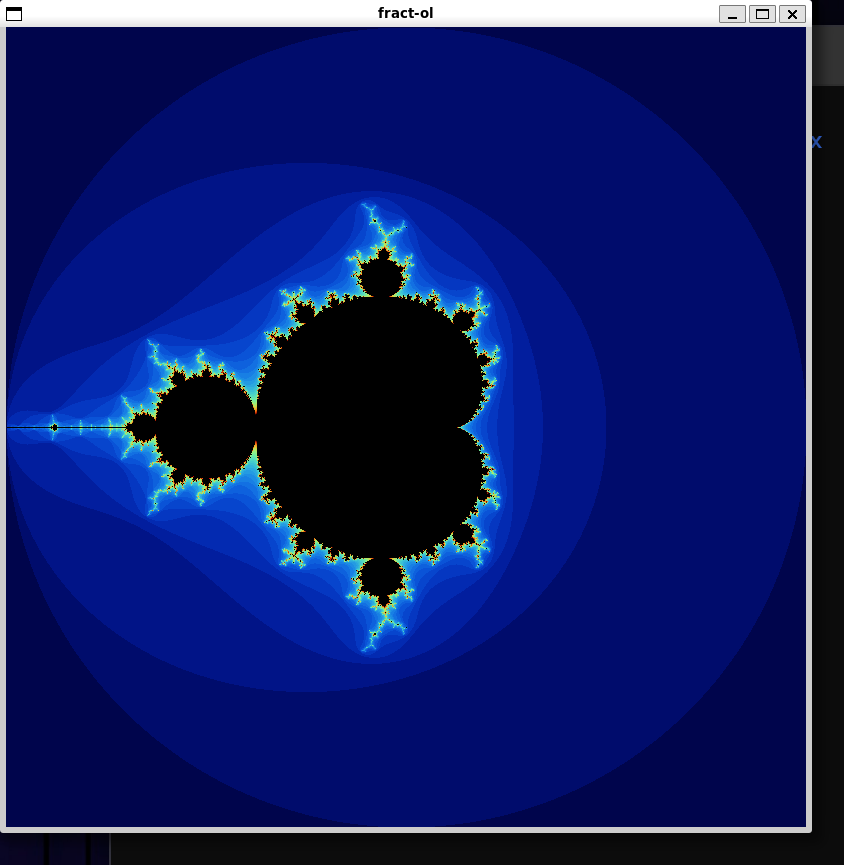
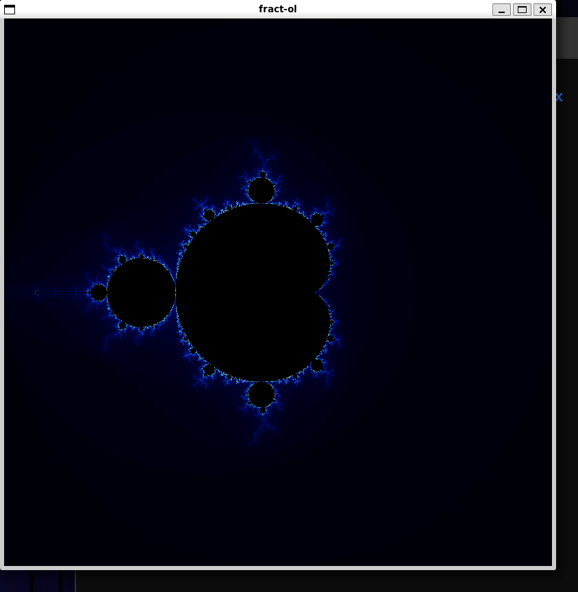
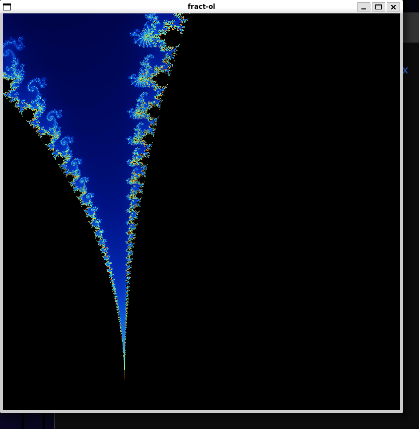
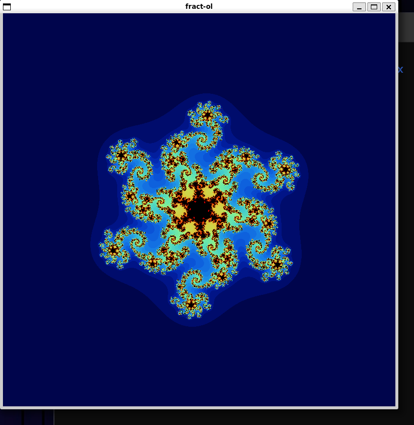
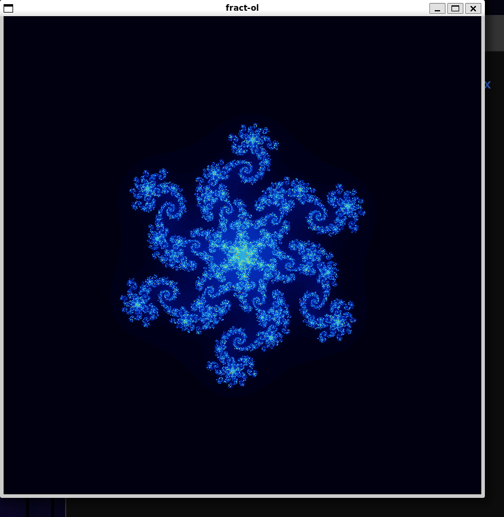
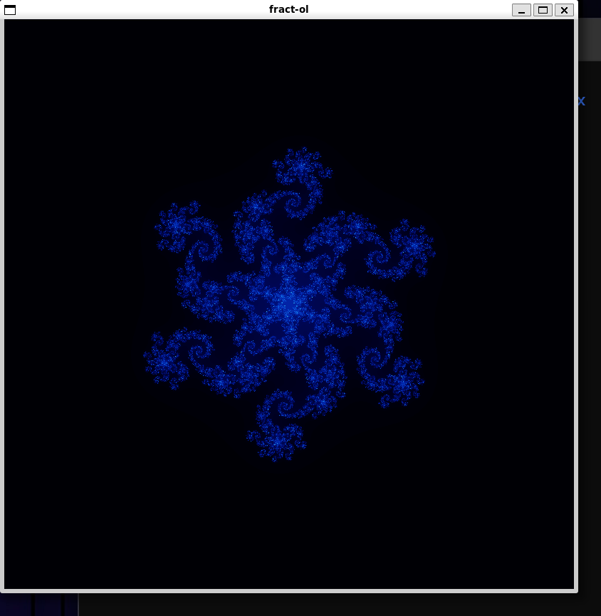

# fract-ol

Interactive fractal renderer built with MiniLibX (X11). It displays Mandelbrot (`brot`), Julia (`julia x y`), and a 6th-degree polynomial fractal (`poly`) in an 800×800 window.

## Features

- Fractal modes: Mandelbrot (`brot`), Julia (`julia x y`), Polynomial (`poly`)
- Mouse wheel zoom centered on the cursor
- Arrow-key panning
- Iteration control: `=` increases and `-` decreases max iterations (±10); `0` resets view/iterations
- Multi-threaded rendering using 8 pthreads

## Tech Stack

- C
- Build: `make` (GNU Make) + `gcc`
- Graphics: MiniLibX for Linux (X11) (`minilibx-linux/`)
- Libraries: X11 (`-lXext -lX11`), math (`-lm`), zlib (`-lz`), pthreads

## Build / Installation

Build MiniLibX (per `minilibx-linux/README.md`):

```bash
cd minilibx-linux && ./configure
```

Build the project:

```bash
make
```

Other Makefile targets:

```bash
make clean
make fclean
make re
```

## Usage

Run one of the supported sets:

```bash
./fract-ol brot
./fract-ol poly
./fract-ol julia x y
```

Controls:

- `ESC`: quit
- `=` / `-`: increase / decrease max iterations
- `0`: reset (iterations, zoom, offsets)
- Arrow keys: move view
- Mouse wheel: zoom in/out

Screenshots:







